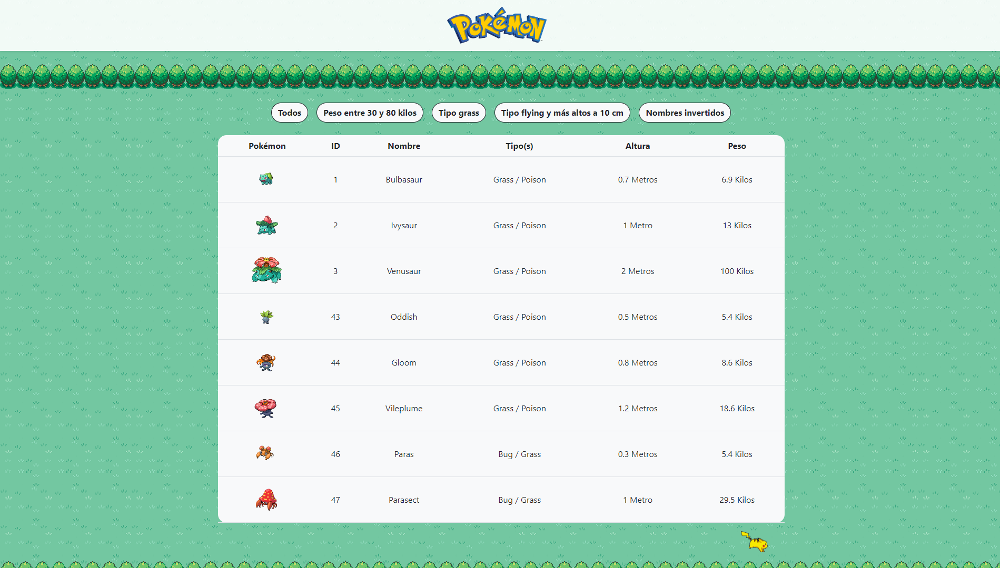
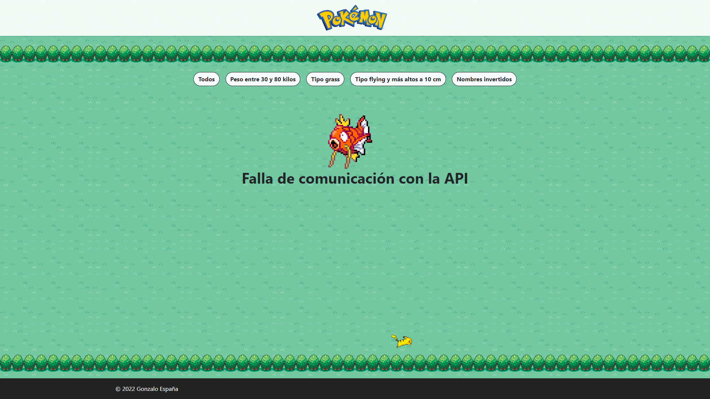

# Desafío Pokémon

El sitio fue desarrollado utilizando React y Django. En se muestran los primeros 50 pokémones de la primera generación ordenados por id. Además, se pueden filtrar según una serie de opciones que se despliegan por pantalla.


## Pre-requisitos

Para utilizar el sitio, se debe tener instalado Node.js y Python 3.6. Para instalar las dependencias, se debe ingresar el comando `npm install` en la carpeta `frontend` y `pip install -r requirements.txt` en la carpeta `backend`.

## Uso

<!-- chart of steps to develop -->

Para activar el sitio se deben ejecutar los siguientes comandos:

- En la carpeta `frontend`

```bash
npm start
```

- En la carpeta `backend`

```bash
python manage.py runserver
```

- En el navegador, ingresar a `localhost:3000`

## Errores y soluciones

Si se arroja el siguiente mensaje:


Esto se debe a que no se encuentra operativa la parte del backend, revisar que se esté ejecutando el comando `python manage.py runserver` en la carpeta `backend`.
